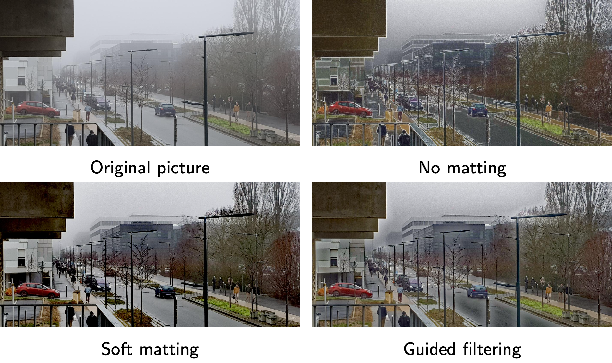

# Single Image Haze Removal using Dark Channel Prior and Guided Image Filtering/Fast Guided Filter
## Numerical Imaging Project - MVA 2020/2021
### Thomas Chabal & Martin Graive

Reimplementation of the Haze Removal method [Single Image Haze Removal Using Dark Channel Prior](http://kaiminghe.com/publications/cvpr09.pdf) from He et al. using [Guided Image Filtering](http://kaiminghe.com/publications/eccv10guidedfilter.pdf) from He et al. and optimizing the computation with [Fast Guided Filter](https://arxiv.org/pdf/1505.00996.pdf) (He et al.).

#### Links
- [Project report](./report/report.pdf)
- [Slides of the presentation](./report/slides.pdf)

#### Main scripts

- To dehaze a single image, simply run `python main.py -p path/to/image --resize max_size_you_want` from the root folder.
- To compare all the matting methods on a single image, run `python evaluate_matting.py -p path/to/image -s path/to/save_folder --resize max_size_you_want` from the `benchmarks` folder.
- To compute all the parameters evaluations on a whole folder, run `python launch_all_evaluations.py -f path/to/images/folder -s path/to/save/folder --resize max_size_you_want` from the `benchmarks` folder.

#### Visual results

#### References
- K. He, J. Sun, and X. Tang. [Single Image Haze Removal Using Dark Channel Prior](http://kaiminghe.com/publications/cvpr09.pdf). IEEETransactions on Pattern Analysis and Machine Intelligence, 33(12):2341–2353, 2011
- K. He, J. Sun, and X. Tang. [Guided Image Filtering](http://kaiminghe.com/publications/eccv10guidedfilter.pdf). IEEE Transactions on PatternAnalysis and Machine Intelligence, 35(6):1397–1409, 2013
- Kaiming He and Jian Sun. [Fast Guided Filter](https://arxiv.org/pdf/1505.00996.pdf). ArXiv, abs/1505.00996, 2015
